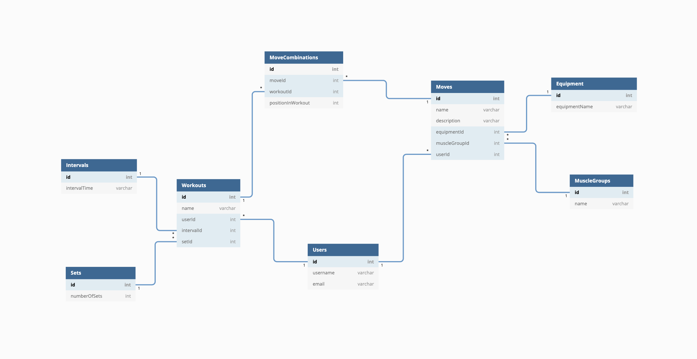
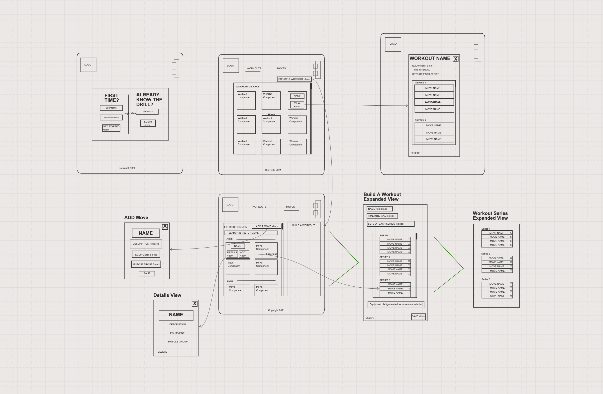
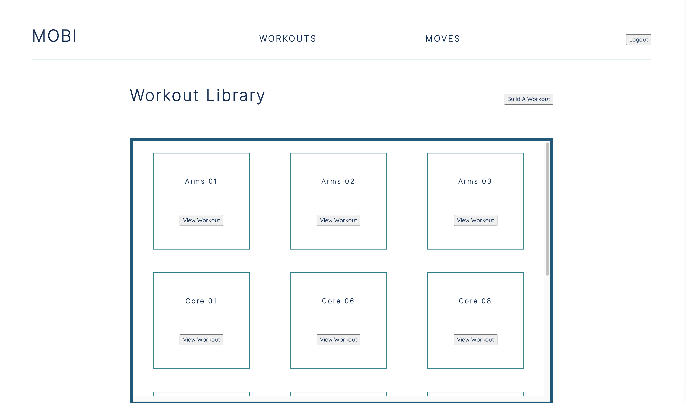
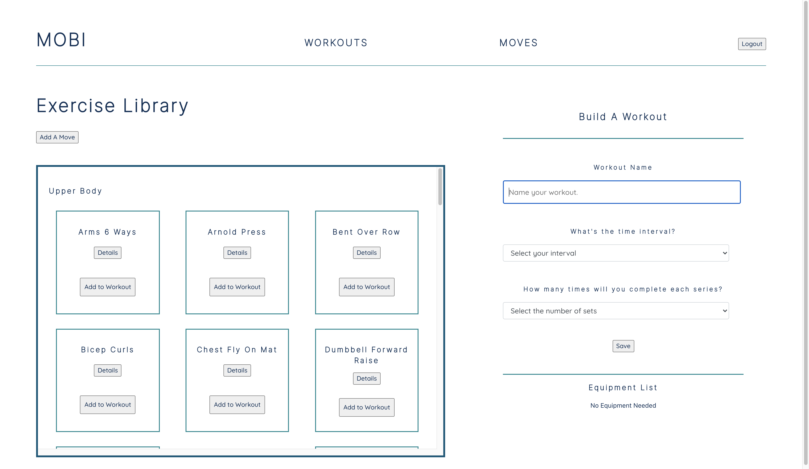

# MOBI

MOBI is designed as a tool for users to create the workouts they want with the moves they already know. After adding moves to their library, users can use the moves to build custom workouts that can be saved and used over and over again. No need to carry around sheets of paper or get lost scrolling through Instagram trying to find a workout. Now you have everything you need in one place to keep moving!

### Features Highlights Include:
- Add, edit, or delete moves from your library
- Create a name, select a time interval and number of sets, and add moves to a new workout
- Custom generated equipment list for each workout based on the added moves
- Easy workout view so you'll know what you need and what you're going to be doing at a glance

## Planning Documentation

### Entity Relationship Diagram
</img>

### Wireframe
</img>

## Tools + Technologies

### Development Tools
Github, Visual Studio Code, dbdiagram, Sketchboard, Postman, JSON Server

### Development Language + Libraries
React, CSS3

## Views

### Workout Library View
Upon logging in, the user can view their workout library and any previously saved workouts. 
</img>

### Move Library/Build A Workout View
Users can add moves to build a new workout.
</img>

# Try It Out
To run ***MOBI*** locally, clone the project by running the following command in your terminal:
> `git clone git@github.com:kohinrichs/mobi-moves.git`

Once you have the project cloned in your terminal, run:
> `npm install`

This will install the libraries and other dependencies used by ***MOBI***.

This project was bootstrapped with [Create React App](https://github.com/facebook/create-react-app).

## Running the Database
You must run JSON server in another instance of your terminal so you will have access to the data that ***MOBI*** is capturing. Navigate to the api directory and run the following command:
> `json-server -p 8088 mobi.json`

This will run the provided sample database on port 8088. Please note that since this test database is inside the development folder, changes to the database may cause the app to refresh. To avoid this, copy `api/mobi.json` to a folder outside the ***Mobi*** directory and run the above command from there.

## Running the App
In the project directory, you can run:
> `npm start`

This runs the app in the development mode.
Open http://localhost:3000 to view ***MOBI*** in your browser.

Log in to the app using the email `me@me.com` to start using ***MOBI***.

## Learn More
You can learn more in the [Create React App](https://github.com/facebook/create-react-app) documentation.

To learn React, check out the [React](https://reactjs.org/) documentation.
